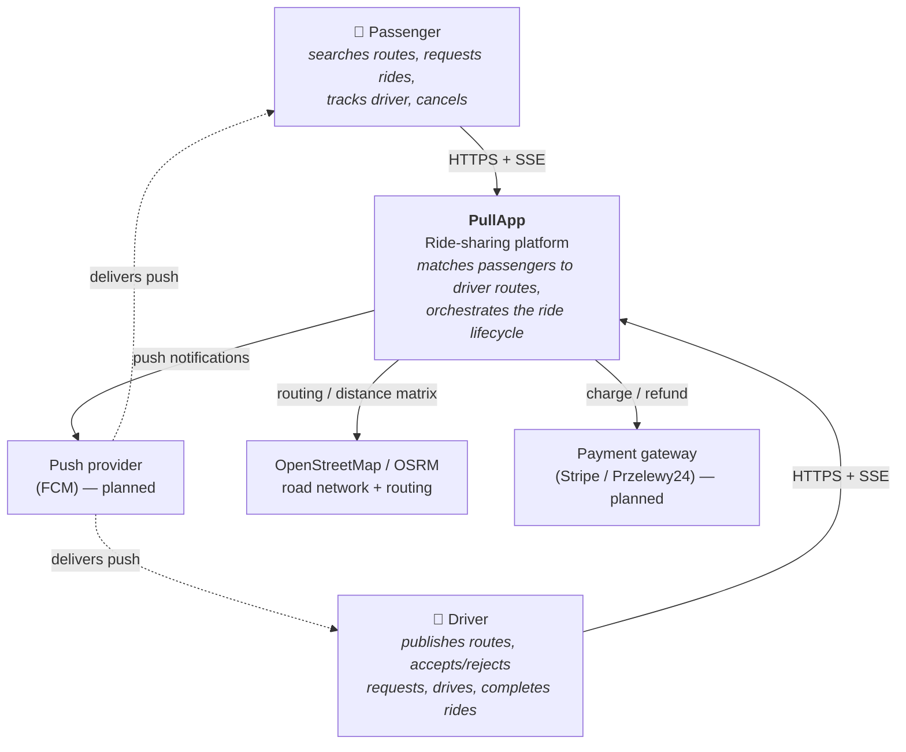

# PullApp — System Context (C4 Level 1)

The highest-level view: PullApp as a single box, the people who use it, and the
external systems it depends on.

## Actors

Both actors are end users on the same mobile/web client. A single account can act
as **both** a driver and a passenger — there are no mutually exclusive roles
(this is a deliberate domain decision; see [auth & profile flow](../04-flows/auth-and-profile.md)).

| Actor | Goal | Key interactions |
|-------|------|------------------|
| **Passenger** | Get a ride along a driver's route | Search routes, send a ride request, get accepted/rejected, meet the driver, ride, complete/cancel |
| **Driver** | Fill empty seats on a route they're already driving | Publish a route, activate it, accept/reject incoming requests, declare pickup, complete the ride |

## External systems

| System | Role | Status |
|--------|------|--------|
| **OpenStreetMap / OSRM** | Road-network data + routing/distance-matrix used by route-calc to score matches and build route geometry | OSRM embedded in route-calc (C++) |
| **Push provider (FCM)** | Out-of-app delivery of domain events (ride accepted, etc.) to devices that don't have an open SSE session | Planned — in-app SSE works today |
| **Payment gateway** | Freeze/charge/refund the ride price and cancellation fee | Planned — trip-planner integrates a `FakePaymentsService` today |

## System boundary

Everything inside the PullApp box is detailed at
[Level 2 — Containers](../02-containers/containers.md). The platform exposes a
**single ingress** (the [gateway](../03-components/gateway.md)); clients never talk
to internal services directly.

## What PullApp is *not*

- Not a hailing/taxi system — drivers publish routes they were already going to
  drive; passengers join them. Matching is route-overlap, not dispatch.
- Not a payments processor — it only freezes/charges through an external gateway.
- Not a maps provider — it serves tiles and routing from OSM-derived data, it does
  not survey roads.
