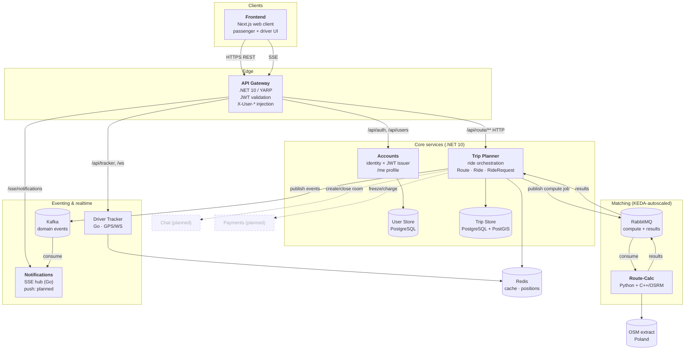

# Container Diagram

C4 Level 2. Solid boxes are implemented and running; dashed are planned/stubbed.
See [containers.md](containers.md) for the per-container detail.

```mermaid
graph TB
    subgraph Clients["Clients"]
        Web["<b>Frontend</b><br/>Next.js web client<br/>passenger + driver UI"]
    end

    subgraph Edge["Edge"]
        GW["<b>API Gateway</b><br/>.NET 10 / YARP<br/>JWT validation<br/>X-User-* injection"]
    end

    subgraph Core["Core services (.NET 10)"]
        Accounts["<b>Accounts</b><br/>identity + JWT issuer<br/>/me profile"]
        TripPlanner["<b>Trip Planner</b><br/>ride orchestration<br/>Route · Ride · RideRequest"]
        AccountsDb[("User Store<br/>PostgreSQL")]
        TripDb[("Trip Store<br/>PostgreSQL + PostGIS")]
    end

    subgraph Compute["Matching (KEDA-autoscaled)"]
        Rabbit[("RabbitMQ<br/>compute + results")]
        RouteCalc["<b>Route-Calc</b><br/>Python + C++/OSRM"]
    end

    subgraph Async["Eventing & realtime"]
        Kafka[("Kafka<br/>domain events")]
        Notif["<b>Notifications</b><br/>SSE hub (Go)<br/>push: planned"]
        Tracker["Driver Tracker<br/>Go · GPS/WS"]
    end

    Redis[("Redis<br/>cache · positions")]
    OSM[("OSM extract<br/>Poland")]

    Chat["Chat (planned)"]:::planned
    Payments["Payments (planned)"]:::planned

    Web -->|HTTPS REST| GW
    Web -->|SSE| GW

    GW -->|/api/auth, /api/users| Accounts
    GW -->|/api/route/** HTTP| TripPlanner
    GW -->|/sse/notifications| Notif
    GW -->|/api/tracker, /ws| Tracker

    Accounts --> AccountsDb
    TripPlanner --> TripDb
    TripPlanner --> Redis
    TripPlanner -->|publish compute job| Rabbit
    Rabbit -->|consume| RouteCalc
    RouteCalc -->|results| Rabbit
    Rabbit -->|results| TripPlanner
    RouteCalc --> OSM

    TripPlanner -->|publish events| Kafka
    Kafka -->|consume| Notif

    Tracker --> Redis
    TripPlanner -.->|create/close room| Chat
    TripPlanner -.->|freeze/charge| Payments

    classDef planned stroke-dasharray: 5 5,opacity:0.6;
```
