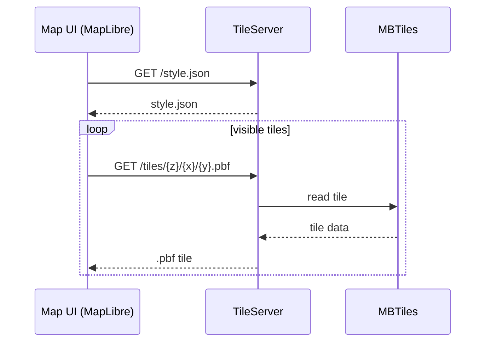

# Tile Server & Map UI

## Component Description

The Tile Server is responsible for delivering map data to the frontend Map UI in the form of tiles.  
The map is not loaded as a single resource – it consists of multiple fragments that are dynamically fetched depending on the current user view.

The frontend is responsible for:

- map initialization
- rendering data
- cache management

The Tile Server is responsible for:

- returning tiles
- returning map style configuration

---

## Runtime Flow

### Map Initialization

1. Frontend loads map configuration:
   GET /style.json

2. Based on the style, the map view is initialized (center, zoom)

---

### Fetching Map Data

1. The map library calculates visible tiles based on:

   - zoom (z)
   - coordinates (x, y)
   - viewport

2. Frontend sends parallel requests:
   GET /tiles/{z}/{x}/{y}.pbf

3. Tile Server:

   - reads data from MBTiles
   - returns tile (.pbf)

4. Frontend renders the map progressively

---

### User Interactions

#### Zoom

- recalculates tiles for new zoom level
- fetches new data

#### Pan

- fetches missing tiles for the new area

#### Cache

- reuses previously downloaded tiles
- no repeated requests for the same data

---

## Flow Diagram



---

## Failure Scenarios

| Scenario                  | Behavior                        |
| ------------------------- | ------------------------------- |
| No internet connection    | Only cached tiles are displayed |
| Missing tiles (high zoom) | Empty tile is returned          |
| Tile Server unavailable   | Map not rendered / fallback UI  |
| Slow connection           | Progressive rendering           |
| Rapid map movement        | Previous requests cancelled     |

---

## Offline Behavior

- cached tiles remain available
- new areas remain empty
- requests can be retried after reconnect

---

## API

### Tiles

GET /tiles/{z}/{x}/{y}.pbf

Returns:

- tile data (.pbf)

---

### Style

GET /style.json

Returns:

- map configuration

---

## Tile Constraints

- Supported zoom levels: 0–14
- Tiles outside this range return empty response
- Coordinate system: Web Mercator (EPSG:3857)

---

## Data

- source: OpenStreetMap (.osm.pbf)
- processing: vector tile generation
- storage: MBTiles file

The Tile Server operates without a database – it reads directly from the file.

---

## Technologies

### Frontend

- MapLibre GL JS
- vector tile support
- no licensing requirements

---

### Tile Server

- TileServer GL
- MBTiles support
- HTTP endpoints (/tiles, /style.json)

---

### Map Data

- OpenStreetMap (OSM)
- open dataset (roads, buildings, POI)

---

## Request Characteristics

- Each viewport requires ~10–20 tile requests
- Requests are executed in parallel
- Rapid interactions may generate burst traffic

---

## Caching

- Tiles are cacheable on client side
- Repeated requests for same tile should be avoided
- CDN caching is recommended for production setups

---

## Frontend Responsibilities

Frontend is responsible for:

- handling loading states
- displaying fallback UI when tiles are unavailable
- cancelling outdated tile requests

---

## Performance Requirements

- parallel requests: 10–20 tiles per viewport
- response time: <200ms (cached)
- data size: ~10–20GB (Poland)

---

## MVP Scope

1. Download OSM data
2. Generate MBTiles
3. Run TileServer GL
4. Integrate with MapLibre

---

## Frontend Integration

Tile URL template:

https://tiles.example.com/tiles/{z}/{x}/{y}.pbf

```javascript
const map = new maplibregl.Map({
	container: 'map',
	style: 'https://tiles.example.com/style.json',
	center: [19.1451, 51.9194],
	zoom: 5,
})
```

Frontend automatically:

- fetches tiles
- manages cache
- renders the map

---

## Summary

The Tile Server delivers map data in the form of tiles.  
The frontend handles rendering and user interaction.  
The component operates as a simple data-serving service without business logic.
