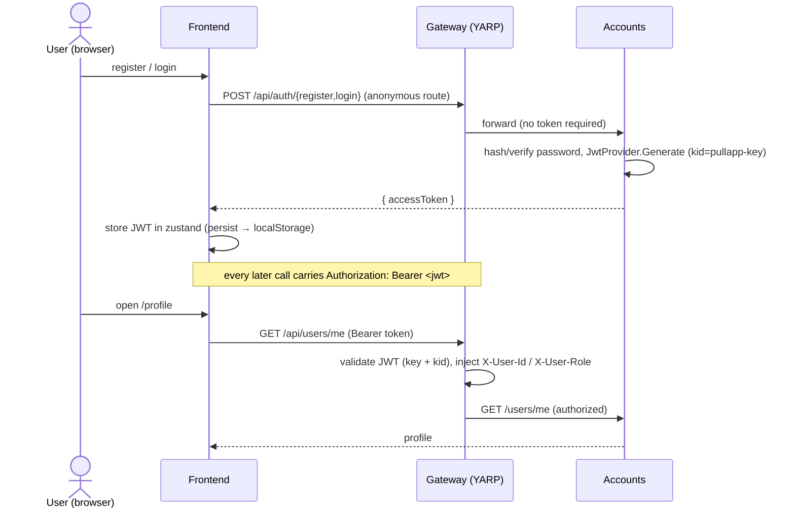

# Flow — Auth & profile

How a user goes from registration to an authenticated request, and how `/me` works.
Confined to **frontend → gateway → accounts** — no other service participates.

## Steps

1. **Register / login** — frontend posts to `/api/auth/register` or `/api/auth/login`.
   These are the gateway's only **anonymous** routes. Accounts verifies credentials
   and returns `{ accessToken }` (HS256 JWT, `kid = pullapp-key`).
2. **Token storage** — the frontend keeps the JWT in a persisted zustand store
   (localStorage), and the api-client attaches it as `Authorization: Bearer` on
   every subsequent request.
3. **Authenticated request** — for any non-auth route the gateway validates the
   token (signing key **and** `kid` must match, or it 401s), then injects
   `X-User-Id` / `X-User-Role` for downstream services.
4. **`/me`** — `GET /api/users/me` requires authorization; accounts returns the
   caller's profile. Accounts wires `UseAuthentication`/`UseAuthorization` so this
   also works when accounts is hit directly.

## Roles

A single account can be **both** driver and passenger — there are no mutually
exclusive role types, and the platform deliberately does not gate driver vs.
passenger actions on a role claim. (`role` exists in the token but isn't used to
partition behaviour.)

## Trust boundary

Internal services trust `X-User-*` headers because the gateway is the only ingress.
Re-verifying the JWT `sub` end-to-end at each internal service is a known,
deliberately deferred hardening item — not required while the gateway is the sole
entry point.

See [gateway.md](../03-components/gateway.md) and [accounts.md](../03-components/accounts.md).
