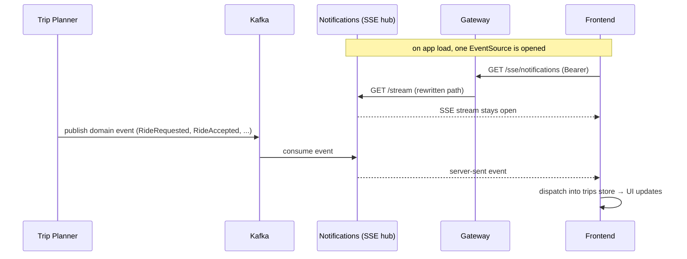

# Flow — Notifications (SSE)

How a domain event in Trip Planner reaches the user's browser in real time.

## How it works

- **Trip Planner** publishes domain events to **Kafka** as JSON envelopes
  (`{ EventType, EventId, OccurredAt, Payload }`).
- **Notifications** consumes Kafka and pushes events to connected browsers over
  **SSE**. Its `/stream` endpoint is exposed by the gateway as `/sse/notifications`
  (path rewritten by YARP).
- **Frontend** opens **one** `EventSource` via the `useNotificationStream`
  singleton (module-level shared connection — components subscribe, they don't each
  connect). A top-level `NotificationListener` dispatches incoming events into the
  trips store, which updates the my-rides / driver views without a refetch.

## Status

- ✅ In-app **SSE** delivery to open browser sessions.
- ⬜ **Push** (FCM) to offline devices — planned. Device-token registry +
  idempotency log are part of the notifications service design but not built.

Which event goes to whom is listed in the
[ride lifecycle flow](ride-lifecycle.md#events--notifications). Component detail:
[notifications.md](../03-components/notifications.md).
